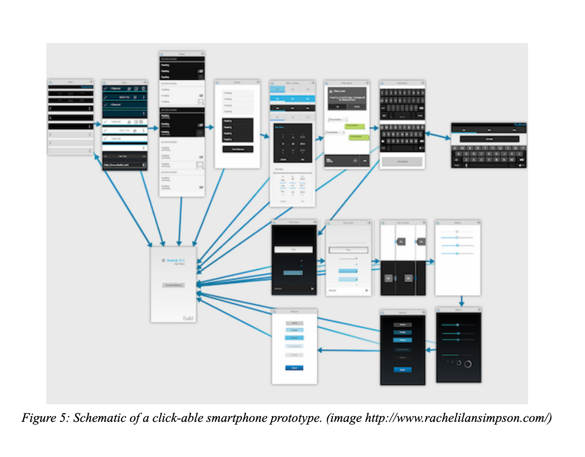
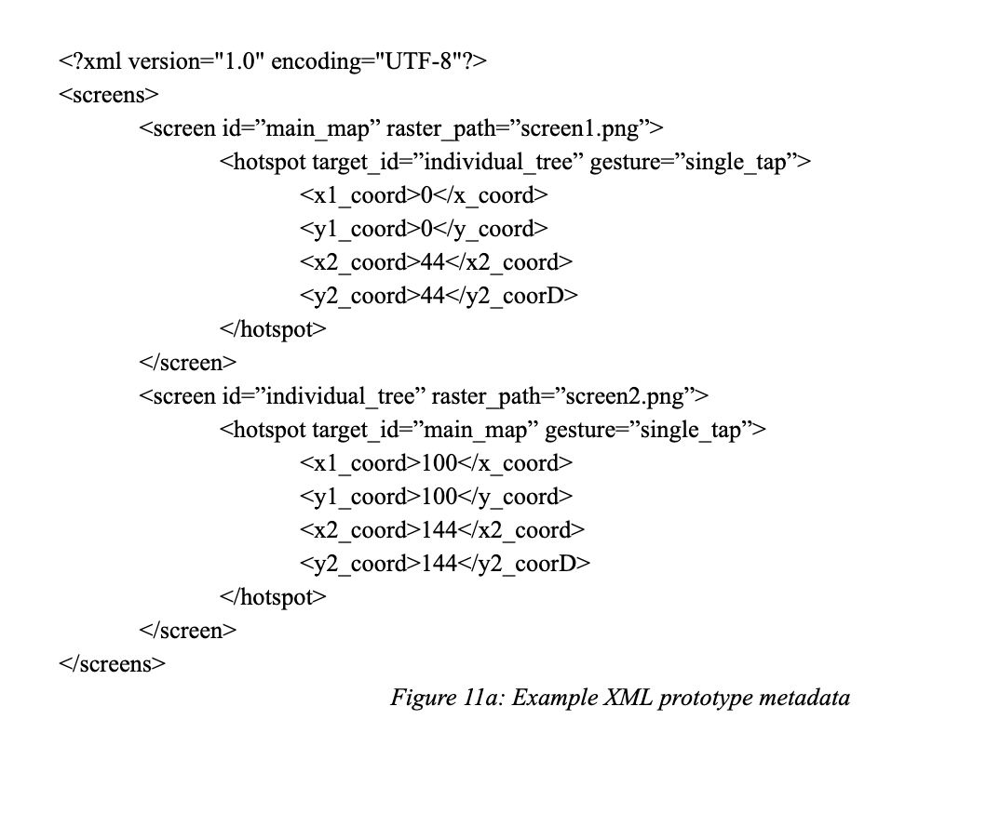

# Developing a Simple VR Prototyping Tool for Exploring Smartphone Applications In Virtual Context - A Case Study, Workflow and Tooling To Be Developed in the Redesign of A Location-based Urban Forestry Application.

## Sam Halperin

**12/12/2014** 


### Abstract
Virtual reality has been used to inform application context and the ecological validity of ubiquitous, location-based, mobile applications during construction. Proposed here is the development and evaluation of new tooling for creating simple, low-cost virtual reality simulations of smartphone applications.  Where previous solutions have been one-off and proprietary, the goal of this research is to create and evaluate a reusable, low-cost general software solution for use in both usability engineering.  

Virtual reality is a complex field involving the interplay of visual, audio, vestibular, proprioceptive, and tactile systems, with computational issues such as rendering speed, display resolution, and positional and orientation tracking capabilities.  How these systems can be used to effectively maintain presence, the sense of being in one place while being physically located in another, and how that presence can be leveraged to study the usability of smartphone applications will be explored.

*Additional figures at end of paper.*

### 1 Problem Statement
Application context, i.e. the ecological validity of an application depends on many factors, including the presence of other users and other devices in the ecosystem, the physical location, ergonomic issues at the physical location, and the interplay between the device being tested and stimuli, dangers, and constraints imposed by the environment.  Typically usability studies of ecological validity have centered on fieldwork-based studies, including diary studies, observation and ethnography.  However, it has been widely noted that compared to lab-based studies, field studies aren’t as repeatable, controllable or as amenable to documenting, i.e. through video recording, as work done in the lab.

Virtual reality is emerging as a solution to this problem, promising to replicate field conditions in-silica.   Central to virtual reality experiences is the concept of presence or the sensation that one is in a place that they are not currently located in.  By using presence, and combining it with virtual prototypes of devices and software interfaces under design, we can effectively study systems before they are built in a simulation of their real environment.

However, VR/VE prototyping experiences are hard to produce.  Some progress has been made into creating experiences that can be used off the shelf in research,  for example the use of Second Life in the social sciences (Fox, Arena, & Bailenson, 2009).  However, in studies where lower level access is needed, i.e. to program the interfaces of virtual washing machines or to study cell phones in supermarkets, researchers comment on the complexity, expense, or requisite skillset for creating the experiences. (Bordegoni & Ferrise, 2013; IKhan, Nuijten, & Deslé, 2011).    

The past development of virtual prototyping setups for evaluating mobile applications has been characterized by one-off solutions that do not represent reusable assets for future research into context and VR.  A recent experiment studying push-notifications on mobile phones in shopping markets  (Hühn, Ketelaar, et al., 2012; Hühn, Khan, Lucero, & Ketelaar, 2012; IKhan et al., 2011), as well as a foundational experiment that prototyped mobile photo sharing (Barton & Vijayaraghavan, 2002), both created one-off systems for their research and are characteristic of other experiments. In the first case, an open-source, high-level 3D graphics engine was used, with modeling of assets done in Maya, and in the second case a hybrid of an off the shelf game engine, and a Java based web server was used to do the prototyping.

The model for creating a reusable solution for mobile prototyping is the automotive domain, where companies like Renault have invested heavily in developing tooling and workflow for product development using VR simulators (Kemeny, 2014; Kemeny & Panerai, 2003).   Work in this area has progressed from experiences on low-resolution CAVES limited to gross interfaces, to the study of fine interfaces made possible by 4K CAVE walls and head mounted displays.  The research done along the way into minimizing barriers such as simulator sickness, drives general knowledge about VR experience design in the process.

### 2 Research Goal
Create and evaluate a simple and reusable VR based smartphone application prototyping tool to serve as a foundation for future VR prototyping research.   It is believed that a solution based on a standard click-able raster format displayed in VR could support a large array of usability research and development as it has in non-VR workflows (Warfel, 2009).  Furthermore this format wouldn’t require users incorporating the tooling into their workflow to have a facility with, or access to expensive game engines or the knowledge needed to program them. To accomplish this, it will be necessary to leverage off the shelf, commercially and publically available 3D assets such as environments, characters, and behaviors (driving..etc.).

Combining a simple schema for defining mobile prototypes (see XML specification in Figure 11) with a platform open to pre-made assets could produce something usable and useful to the usability and requirements engineering workflows of modern engineers working to develop mobile applications.	

### 3 Research Questions
1. How can a solution leverage the pre-constructed assets available in asset stores like the Unity Asset Store, Turbo Squid, and the SketchUp Asset Warehouse?
2. How do the limitations of low-cost, widely available, consumer-grade VR tools such as the Oculus Rift constrain the solution.  For example in terms of resolution, limited positional tracking, lack of haptic feedback.
3. What is the minimum viable feature set needed to support usability research and application development using VR?  Among authoring and displaying clickable rasters in a VE, networking, event, DSL support and other capabilities, what represents a feasible and effective first solution?
4. What is the qualitative experience of using such a tool for people who fulfill traditional software engineering roles such as UX designer or requirements animator.
5. How do virtual prototypes of smartphone apps compare with physical prototypes in terms of analysis of “efficiency and effectiveness of task completion,” (Delikostidis et al., 2013) and are results from VR studies proportional to evaluation of the resulting actualized systems, i.e., is the VR prototyping method valid?

### 4 Relevance, Significance, Literature Review
#### 4.1 Application Context, Ecological Validity and Lab-based Usability Studies
Physical application context is particularly responsible for the design and ultimate success of applications. (Delikostidis, Fechner, Fritze, AbdelMouty, & Kray, 2013; Hühn, Khan, et al., 2012; Pérez & Valderas, 2009)  For example, in driving studies the interaction between the driver, the device, the devices software and the environment form the complete picture (Esbjornsson, Juhlin, & Weilenmann, 2007). 

The ecological system that the device and user fit into is called its ecological context, and the degree to which the device being engineered is studied in a way that correctly reflects the requirements of the environment are referred to as the studies “ecological validity” (Schellenbach, Krüger, Lövdén, & Lindenberger, 2007) It is not uncommon for engineers to only discuss application within a discursive representation of the application’s  ecological context.  For example statements like “If I were measuring a tree’s diameter, I would want the app to…”, or “If I were walking around a neighborhood looking at trees, I would want to be able to see….” are common.  

Various traditional techniques for getting ecologically valid input about an app have been used, such as diary studies and ethnography, all examples of fieldwork based usability studies (Kjeldskov & Skov, 2007).  At the same time controllable, repeatable and documentable experimental conditions, i.e. lab-based conditions, are desirable in the design process  (Delikostidis et al., 2013; Hühn, Khan, et al., 2012).

It has been noted that fieldwork lacks the experimental and logistical control of lab-based studies. Typically context and experimental control are conflicting aims, one or the other can be achieved using lab-based or in-situ fieldwork studies (Delikostidis et al., 2013; Hühn, Khan, et al., 2012)  . See figure 1.

Kjeldskov et. al., gave a good summary of in Situ versus in-lab usability evaluation techniques: (Kjeldskov & Skov, 2007)
+ Types of in laboratory usability research methods:
  + think-aloud - think aloud when using the project
  + video recording - recording interaction using video, including capture of the interface and device.
  + observation
+ Types of in-situ evaluation
  + workplace observation - observing users in their workplace
  + contextual inquiry - a one-on-one inquiry of an operator done during and from within their operating context.
  + interviews
  + focus groups
  + automatic logging of user actions
  + acting out in context
  + cultural probes - diary based running commentary on a system from a single users perspective
  + technology probes

Esbjornsson et al., used ethnographic study of drivers in traffic, en example of field based research, to inform knowledge about accommodations drivers make to communications technology (Esbjornsson et al., 2007).  For example they noted that drivers frequently mention the traffic conditions that they are currently encountering.  They also offered a criticism of past simulator-based driving  studies where  the specific critique was around the artificial nature (solving math problems) of the tools used to study driving concentration.

While critical of simulator based exercises (in contrast to field-work based ethnography), particularly those comprised of contrived communication between subjects, Esbjornsson left open the possibility that a more realistic simulator (of which a VR simulator is a specific type, discussed in the next section) could be used in a future study. They noted that an advantage of a simulator of high enough fidelity (see below) would be to be able to rapidly test combinations of device interface and traffic conditions, as would not be feasible in field work.

### 4.2 Validity and Relevance of VR Simulation
#### 4.2.1 The emergence of VR Simulation
VR simulation has emerged as a way to get the experimental controls of the laboratory with the realism of the natural environment. (Fox et al., 2009; Hühn, Khan, et al., 2012; Stone, Panfilov, & Shukshunov, 2011)  and has been shown to be useful in determining the “functional and psychological requirements of product[s]”  (Carulli, Bordegoni, & Cugini, 2013) see Figure 2.

More so than with low resolution, low field of view, untracked, consumer devices of the past, virtual reality devices like the Oculus Rift seem on the cusp of more widespread consumer adoption (Rubin, 2014).  The Rift provides a platform for cheaply and easily exploring the effects of ‘presence’, or the illusion of being in a space that one does not physically inhabit (Witmer & Singer, 1998). 

Specifically referring to the task of using VR in the engineering process of a mobile application, Schellenbach  noted that “...system developers can have ready access  (i.e. in their office) to a high fidelity recreation of a user’s experience of using a prototype mobile system on location.” (Schellenbach et al., 2007)

Delkikostidis et. al., surveyed recent work on VE’s used for the simulation of mobile devices.  While the work looked at came before recent developments in the availability of low cost, high resolution, high field of view, tracked 3D hardware, they nevertheless concluded at that time that VR was a valid approach for studying these applications (Delikostidis et al., 2013).

A particular contribution of the early paper on UBIWISE a one-off prototyping tool in this area (Barton & Vijayaraghavan, 2002) was the idea that a significant aspect of the applications context is the presence of other users and other devices.  They prototyped a client-server VR arrangement and used an interaction between a user with a digital camera, a user with a precursor device to modern smartphones, and a wall mounted display, demonstrating the use case for taking a photo, moving it to the wall, and then downloading it onto another handheld, all in a VR environment.

#### 4.2.3 Validity of VR Simulation
A cited future direction for research is the comparison of virtual prototyping with physically based ‘real’ prototypes (Delikostidis et al., 2013).  The validity of VR as a simulation tool in general is demonstrated below, however the specific validity of any particular tool still needs to be demonstrated. One of the goals of this project is to evaluate the tool created in terms of it’s validity at simulating real world tasks on a virtual object.

Kjeldskov and Skov (2007) used a system of in-laboratory simulation to model real operating environments such as the bridge of a ship.  They noted that while purely in-silica simulation of these types of environments is possible, their use imposes questions about the validity of the simulation before questions about the usability of the product can be entertained.  

A randomized field study of VR laparoscopy training provided some evidence to suggest that VR training contributes to faster gall bladder surgeries with lower errors and defter movements, although no definitive recommendations for including VR in the training regimen of junior surgeons was concluded (Grantcharov et al., 2004).  This is perhaps the most compelling argument for ultra high fidelity simulation.  (Referring to functional, task, and equipment fidelity, not necessarily visual and graphical fidelity, see below).  That life critical tasks can be simulated and the simulation can be used as training for future procedures on real patients is a compelling argument for VR.

Underwood argued that standard simulation was a valid approach to measuring driving behavior in the laboratory (Underwood, Crundall, & Chapman, 2011).  They noted that simulation is particularly suited for exploring large permutations of hazard scenarios (did the pedestrian look over their shoulder before crossing the street, is there  a parked truck...etc.).  Differences in application functionality and interfaces  can also be added to the combinations of context, scenario and user and can rapidly be tested. Additionally, they pointed out some shortcomings of standard driving simulators, such as missing binocular and parallax cues that could be provided by immersive VR. 

### 4.2.4 Fidelity
When the definition of fidelity is expanded beyond the realism of the 3D graphics (i.e., the realism of volumetric rendering or shader technology), evaluating a simulation’s fidelity becomes an important criteria for evaluating its quality.  Fidelity in simulation, drawn from theory about simulators used for training, falls into 5 categories: Equipment, Environmental, Psychological, Task and Functional fidelity (Dahl, Alsos, & Svanæs, 2010).   These are elaborated on in the context of the tree mapping app below:

+ **Equipment Fidelity**: In a VR simulation of a mobile application interface, equipment fidelity would refer to the visual representation of the phone model (which adds fidelity), as well as to the lack of haptic in the same model (where fidelity is missing).  I.e., equipment fidelity refers to the degree to which the simulation feels like the same thing.
+ **Environmental Fidelity**:  in this VR simulation, we will be adding a great deal of visual, and potentially auditory context.  However, there are elements of the operating environment that will be difficult to model but important: for example:  interfaces can be designed for high levels of natural sunlight by modulating contrast in the interfaces.  Our VR system may hint at this requirement, but won’t directly test it.  On the other hand, the functional environmental context, I.e. the relationship between application, user and tree/tree planting site, will be thoroughly explored. 
+ **Psychological Fidelity**: One of the hoped benefits of this type of simulator is to put developers into a context where they can imagine the psychological motivations of actual users.  For example, logging data about an old-growth redwood in the (even virtual) presence of a stand of these trees might produce a different interface, or at least a different commitment to developing a good realized experience.
+ **Task Fidelity**: It is hoped that the added visual environmental context will inform the “degree to which participants experience the simulation aoperationally realistic” (Kjeldskov & Skov, 2007), meaning that it will be easier to envision tree map features in an environment with visual trees. 
+ **Functional Fidelity**:  The series of linked screenshots won’t be a high fidelity representation of the functionality of the app.  This is a cost/benefit tradeoff between developing fast, iterative prototypes and the requirements to develop actual software.

### 4.2.4 VR Challenges
#### 4.2.4.1 VR Novelty / VR Naivety
Söderman (2005) pointed to the issue of “The product and the representation” to discuss comments on a VR experience that seemed based in the experience as mediated by VR interface, rather than the representation of the realized device (in this case a car interior.)  They noted that some feedback of a VR experience of a car model seemed to center on the VR experience itself, rather than in the model of the car being explored.  

An interesting are of future study could potentially be how VR naïve users and experienced viewers reach conclusions based on VR experiences.  It has been noted that simulator sickness is a significant issue in VR simulations (Kemeny, 2014), less well explored is how accommodation to VR environments through experience change this result.

#### 4.2.4.2 Visuomotor Abstraction
Fu, Hershberger, Sano, and Çavuşoğlu (2012), refer to conflicting research about the importance of movements that reflect normal hand-eye coordination versus abstractions.  For example, the traditional mouse/keyboard/display as used in a Computer Aided Design, imposes an abstraction on the actual physical manipulation of a model that could be accessed directly through haptic devices and an egocentric view.

Their study was on the efficiency of this abstracted interaction and found that real interaction was universally more efficient than virtual one (Fu et al., 2012).    However they also noted that the degree to which abstraction effects the validity of using the simulation might not be proportional to the level of abstraction.  If conclusions from the simulation are reflected proportionally in the eventual built/programmed device, then the simulation is, on some level valid.

Underwood et al. (2011) asked this question about driving simulators, pointing to the disconnect between the rate of participation of phones in actual accidents and the effects of cell phones on driving in a simulator.  Their conclusion was that driver accommodations not studied by the simulation, for example talking while parked, and placing the phone on the steering wheel while dialing to minimize time looking away from the road, were responsible for the discrepancy.

#### 4.2.4.3 Applications Where Locomotion and Navigation is the Object of Study
Delikostidis et al. (2013) noted, supporting locomotion can be difficult to in simulation.  There has been some progress in this area,  for example work has been done on redirected walking to use smaller physical spaces to model larger environments (see for example Azmandian, Bolas, and Suma (2014)).   The contribution of the vestibular, and proprioceptive systems to valid simulator models in driving has been noted (Kemeny & Panerai, 2003).  A simulator that is missing physical locomotion could produce potentially invalid results when evaluating navigation based or map based tasks due to the missing “self motion” (Schellenbach et al., 2007) of the apparatus design.  

### 4.3 Simulation Tooling
Simulations must support both 3D graphics and  immersive hardware, such as head tracking, stereoscopic rendering / barrel distortion.  Implementations run the gamut from the manipulation of polygons at the vertex level to high level scripting of 3D models, including built in support for sound, rigid bodies, networking, etc.    A brief overview of a few popular computer graphics toolkits follows:

### 5 Barriers and Limitations
#### 5.1 Limited Resolution of the Oculus Rift Head Mounted Display
The Oculus Rift is an appealing piece of hardware because of its cost and the driver support for easy to use, high-level graphics engines like Unity.   As seen in other aspects of VR limitations like simulator sickness, it is often necessary to scale aspects of the simulation to work around a shortcoming of the hardware system.   Acceleration or velocity might be proportional to the velocity of the locomotion or driving, without necessarily being directly representative.

Similarly, it may be necessary to geometrically scale mobile devices rendered on the Rift for reasons of resolution.  Kemeny (2014) notes that resolution limitations have begun to improve as CAVE environments move to 4K displays, but that a CAVE running a standard display is limited to between 2.5 and 4 arc minutes of resolution (see Figure 12).  

This limitation warrants an initial feasibility study or proof of concept on the Rift to check that it is possible to represent and interact with mobile prototypes in VR using this specific setup, before a larger work is undertaken.

#### 5.2 Issues common to VR Simulation and Training Tools
A main barrier in the use of VR for simulation is the occurrence of simulator sickness.  These are due to a mismatch between the vestibular system and the rendered display.  They fall into two classes:  transport delays, or delays in faithfully rendering the users orientation changes, and large translations/rotations/accelerations that have no physical counterpart (Kemeny, 2014).  Please see the literature review section 4.2.4 for a further review of issues common to VR simulation and training.  

### 5.3 Integration / Reinvention of Existent Tooling
Providing for level-editing at once seems critical to the usefulness of this type of simulator tooling. Providing the capacity to create both static 3D visual, rigid body, and audio content, and dynamic, scripted, responsive content means that the tool can be adapted to a wide array of situations.   Good tooling already exists for creating 3D assets, and it is not necessary to replicate existing modelers such as Maya, SketchUp, Unity itself..etc.  This is essentially an integration problem rather than a novel development problem.

At the same time it seems likely that providing a fixed set of basic scenes, such as navigating a city on foot, driving a car, sitting at a workstation, sitting in a meeting room...etc. might provide enough functionality to bootstrap a community of toolset users.

### 5.4 Other Users are a Significant Component of Application Context.
Other users and their devices form a key component of application context. This last subsection is less a barrier and limitation than an idea for a medium-scale enhancement to the toolkit that should be attempted in a future iteration: Barton and Vijayaraghavan (2002) specifically point to the presence of other users and other devices as a target of research for ubiquitous applications in VR simulators.  Supporting more than one user and more than one device in the VR should be considered.

Unity Game Engine, the game engine proposed as the foundation for this study, natively supports network communication.  It might be interesting to augment click events on a simulated device with some sort of shared event system that could notify other devices.  These devices would have to be able to receive the event and switch to the appropriate screen.  A good first step towards this would be an event specification or other technical specification akin to the XML screen/gesture specification in the appendix.

### Approach
Use the open source OpenTreeMap Android application as a case study to evaluate workflow and tooling for presenting software prototypes in context  in VR. 

1. Recruit a group of user experience designers (at least 2), developers, and/or project managers with a background in mobile application design and development. (Stakeholders)
2. Assign stakeholders to two groups (See figure 3) viewing prototypes under the following in-laboratory experimental conditions:
    + Group 1, Real Device Group (RDG): prototypes on real/physical device (figure 8) with only photographic (figure 7a, 7b) and discursive application context. 
    + Group 2, Virtual Prototype Group (VPG): prototypes on virtual device with application context provided by virtual environment. (figure 9)
3. Construct and present to stakeholders in both VPG and RDG experimental groups the following: A prototype derived from linked screenshots of version 1 application. (figure 5, 6, 11a, 11b). 
4. Perform validity/task completion tests between the two experimental groups.
5. Have stakeholders, led by User Experience Design professionals in each group, construct a prototype representing an enhancement to the existing application using tools in their specific experimental group (VPG or RDG)
6. Form a focus group or groups comprised of similar stakeholders (who have not been through the experiment) to  compare the resulting prototypes and recorded discussions from RDG and VPG.  If an industry partnership is available, form one focus group from actual project stakeholders.

###Outcomes
1. Validity/Task Completion tests of virtual prototypes comparing RDG and VPG. (figure 4)  (Modeled on Bordegoni & Ferrise, 2013).   
2. Focus group comparison of both methods based on final prototypes from VPG and RDG with respect to the following question areas:
    * Completeness of functional requirements represented by final prototypes.
    * Usability of the design proposed by the prototypes for the following activities:
        * tree diameter measurement
        * new tree planting
        * dead tree removed from plot
        * first data logging of new tree in database.
3. Anecdotes / Sentiment analysis about participatory design sessions from recorded discussions in each group, focused on the following:
    * general comments about the prototype and prototype workflow’s usability / quality / usefulness.
    * consensus about inclusion of individual functional requirements in the application design.
    * where there is discordance around FRs,  what is the evidence (discursive, photographic, virtual) used to support arguments

### 6 Conclusion
A virtual reality tool for presenting mobile application prototypes was discussed.  The aim of the study is to focus on creating reusable tooling, and its evaluation in terms of simulator validity and contribution to the usability engineering processes.  Unity Game Engine was proposed as a foundation for this development.  The design of a second generation of an existing mobile location-based application should be used as a case study.

### Figures

### References
Azmandian, M., Bolas, M., & Suma, E. (2014). Countering user deviation during redirected walking. Paper presented at the Proceedings of the ACM Symposium on Applied Perception.

Bailenson, J. N. (2013, 8/4/2013). [Personal Communication].

Barton, J. J., & Vijayaraghavan, V. (2002). Ubiwise, a ubiquitous wireless infrastructure simulation environment. HP Labs. 

Bordegoni, M., & Ferrise, F. (2013). Designing interaction with consumer products in a multisensory virtual reality environment: This paper shows how Virtual Reality technology can be used instead of physical artifacts or mock-ups for the new product and evaluation of its usage. Virtual and Physical Prototyping, 8(1), 51-64. 

Carulli, M., Bordegoni, M., & Cugini, U. (2013). An approach for capturing the voice of the customer based on virtual prototyping. Journal of Intelligent Manufacturing, 24(5), 887-903. 

Dahl, Y., Alsos, O. A., & Svanæs, D. (2010). Fidelity considerations for simulation-based usability assessments of mobile ICT for hospitals. Intl. Journal of Human–Computer Interaction, 26(5), 445-476. 

Delikostidis, I., Fechner, T., Fritze, H., AbdelMouty, A. M., & Kray, C. (2013). Evaluating Mobile Applications in Virtual Environments: A Survey. International Journal of Mobile Human Computer Interaction (IJMHCI), 5(4), 1-19. 

Esbjornsson, M., Juhlin, O., & Weilenmann, A. (2007). Drivers Using Mobile Phones in Traffic: An Ethnographic Study of Interactional Adaptation. International Journal of Human-Computer Interaction, 22(1/2), 37-58. doi: 10.1207/s15327590ijhc2201-02_3

Fox, J., Arena, D., & Bailenson, J. N. (2009). Virtual reality: A survival guide for the social scientist. Journal of Media Psychology: Theories, Methods, and Applications, 21(3), 95. 

Fu, M. J., Hershberger, A. D., Sano, K., & Çavuşoğlu, M. C. (2012). Effect of Visuomotor Colocation on 3D Fitts' Task Performance in Physical and Virtual Environments. Presence: Teleoperators & Virtual Environments, 21(3), 305-320. 

Grantcharov, T. P., Kristiansen, V., Bendix, J., Bardram, L., Rosenberg, J., & Funch‐Jensen, P. (2004). Randomized clinical trial of virtual reality simulation for laparoscopic skills training. British Journal of Surgery, 91(2), 146-150. 

Hühn, A. E., Ketelaar, P., Khan, V.-J., Lucero, A., van Gisbergen, M., & Bouwknegt, H. (2012). Ad Intrusiveness of Location-Based Advertising–A Virtual Reconstruction Advances in Advertising Research (Vol. III) (pp. 191-207): Springer.

Hühn, A. E., Khan, V.-J., Lucero, A., & Ketelaar, P. (2012). On the use of virtual environments for the evaluation of location-based applications. Paper presented at the Proceedings of the SIGCHI Conference on Human Factors in Computing Systems.

IKhan, V.-J., Nuijten, K., & Deslé, N. (2011). Pervasive Application Evaluation within Virtual Environments. Paper presented at the PECCS.

Kemeny, A. (2014). From driving simulation to virtual reality. Paper presented at the Proceedings of the 2014 Virtual Reality International Conference.

Kemeny, A., & Panerai, F. (2003). Evaluating perception in driving simulation experiments. Trends in cognitive sciences, 7(1), 31-37. 

Kjeldskov, J., & Skov, M. B. (2007). Studying Usability In Sitro: Simulating Real World Phenomena in Controlled Environments. International Journal of Human-Computer Interaction, 22(1/2), 7-36. doi: 10.1207/s15327590ijhc2201-02_2

Pérez, F., & Valderas, P. (2009). Allowing end-users to actively participate within the elicitation of pervasive system requirements through immediate visualization. Paper presented at the Requirements Engineering Visualization (REV), 2009 Fourth International Workshop on.

Rubin, P. (2014). The Inside Story of Oculus Rift and How Virtual Reality Became Reality. Wired.

Schellenbach, M., Krüger, A., Lövdén, M., & Lindenberger, U. (2007). A laboratory evaluation framework for pedestrian navigation devices. Paper presented at the Proceedings of the 4th international conference on mobile technology, applications, and systems and the 1st international symposium on Computer human interaction in mobile technology.

Söderman, M. (2005). Virtual reality in product evaluations with potential customers: An exploratory study comparing virtual reality with conventional product representations. Journal of engineering design, 16(3), 311-328. 

Stone, R. J., Panfilov, P. B., & Shukshunov, V. E. (2011, 9-11 June 2011). Evolution of aerospace simulation: From immersive Virtual Reality to serious games. Paper presented at the Recent Advances in Space Technologies (RAST), 2011 5th International Conference on.

Sudhakaran, S. (N.D.). Image Resolution. 2014, from http://wolfcrow.com/blog/image-resolution/

Underwood, G., Crundall, D., & Chapman, P. (2011). Driving simulator validation with hazard perception. Transportation research part F: traffic psychology and behaviour, 14(6), 435-446. 

Warfel, T. Z. (2009). Prototyping: a practitioner's guide: Rosenfeld media.

Witmer, B. G., & Singer, M. J. (1998). Measuring presence in virtual environments: A presence questionnaire. Presence-Teleoperators and Virtual Environments, 7(3), 225-240. doi: 10.1162/105474698565686

